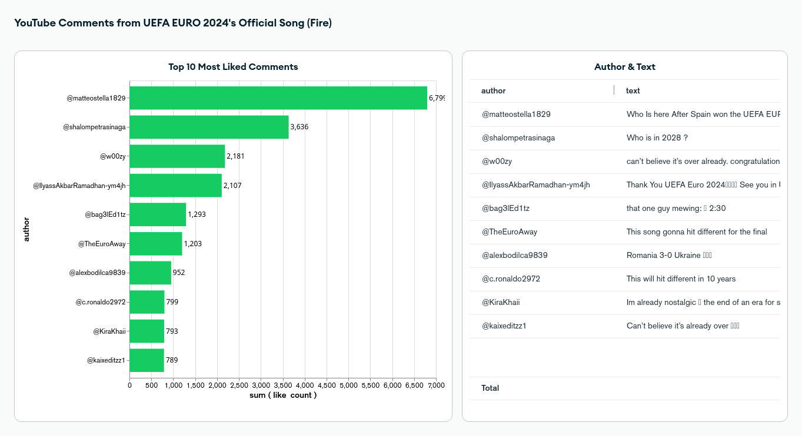

# Real-Time Data Pipeline: Streaming and Processing YouTube Comments with Apache Kafka, Flink, and MongoDB

## Introduction

In this article, we built a real-time data pipeline that grabs YouTube comments, processes and filters them with Flink, and then stores everything in MongoDB for deeper analysis. By adding MongoDB Charts to the mix, we turned the data into easy-to-understand, interactive dashboards that let us pull out valuable insights. This whole setup shows just how powerful real-time analytics can be, helping us keep tabs on and make sense of data as it flows through the system.

## Architecture 

## Simple Dashboard

## Technology Used
- Python
- Apache Kafka
- Apache Flink
- MongoDB
- Docker

## Dataset Used
The data used in this project is sourced from YouTube's API and consists of comments from the official UEFA EURO 2024 song video, “Fire” by MEDUZA, OneRepublic, and Leony, which are retrieved using the YouTube API. The project collects detailed information about each comment, such as the comment author’s name, the text of the comment, the number of likes it has received, and the timestamp when the comment was posted. After gathering the comments, the data is processed and filtered in real-time using Apache Flink, focusing on specific features like like counts, and is then stored in MongoDB for further analysis and visualization.

More info about Youtube API:
https://developers.google.com/youtube/v3

## Article About this Project 
Medium Article - https://medium.com/@ahmadkamiludin/building-a-real-time-data-pipeline-streaming-and-processing-youtube-comments-from-uefa-euro-afb3c770fdae